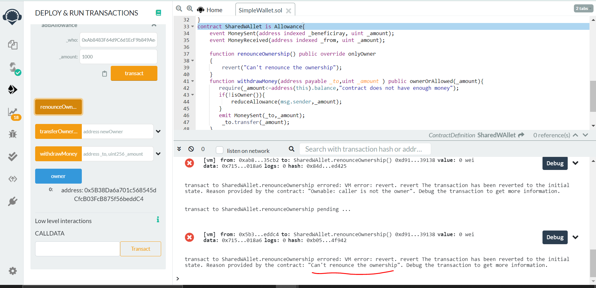
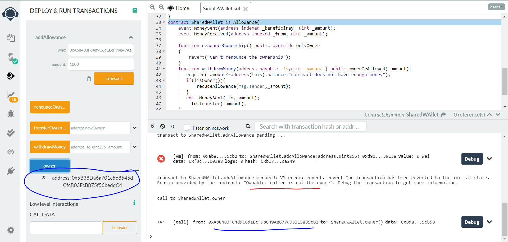

# smart_contract_
SimpleWallet Project
• This is an on-chain wallet smart contract. 
• This wallet contract can store funds and let users withdraw again. 
• You can also give “allowance” to other, specific user-addresses. • Restrict the functions to specific user-roles (owner, user)
• Re-Use existing smart contracts which are already audited to the greatest extent

#smart contract is perfectly secured with owner functionality and disabling renouncing ownership 

